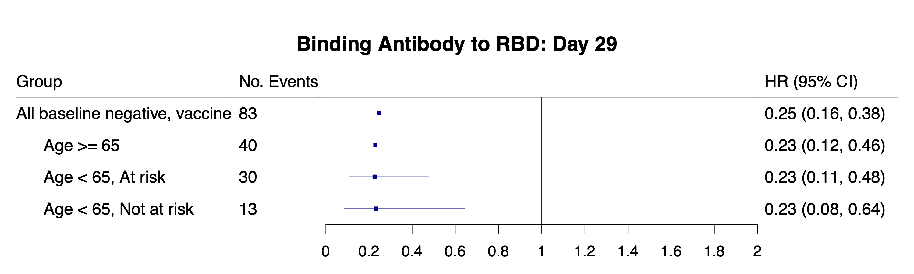
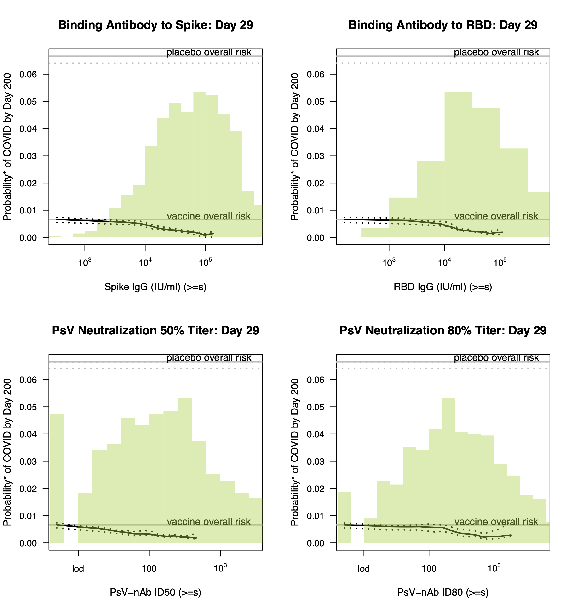
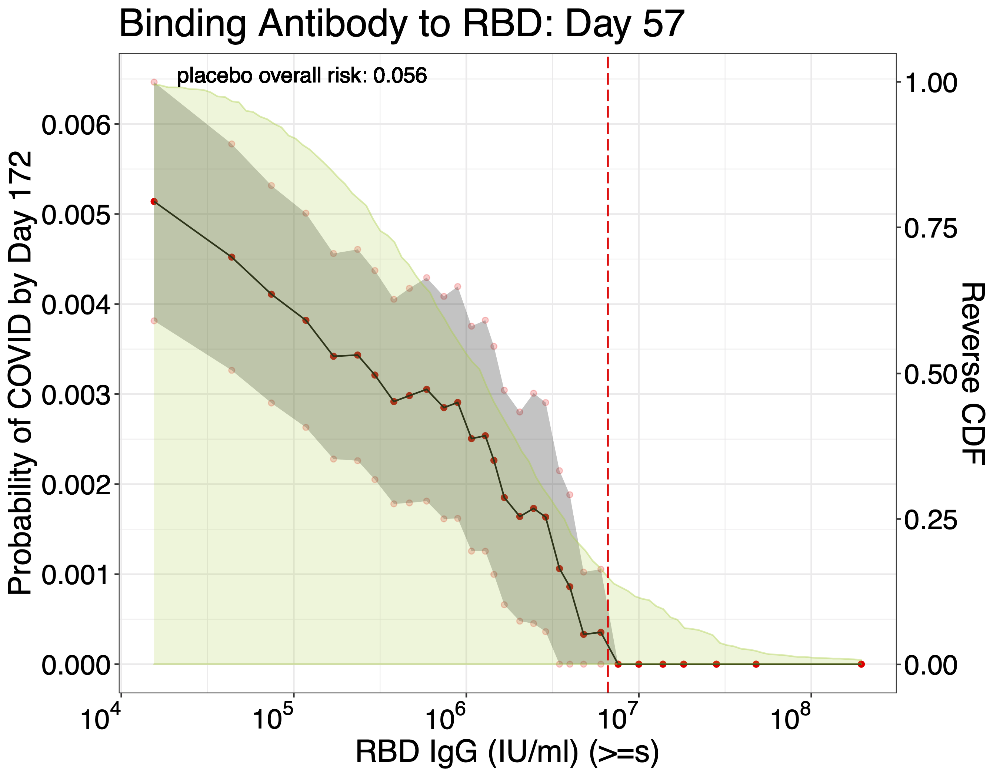
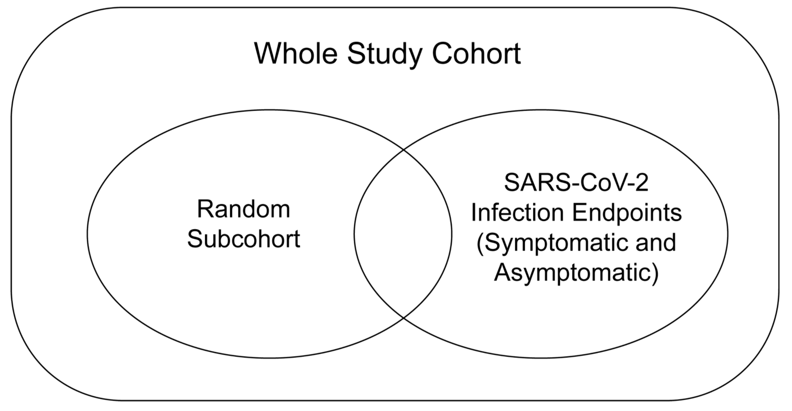
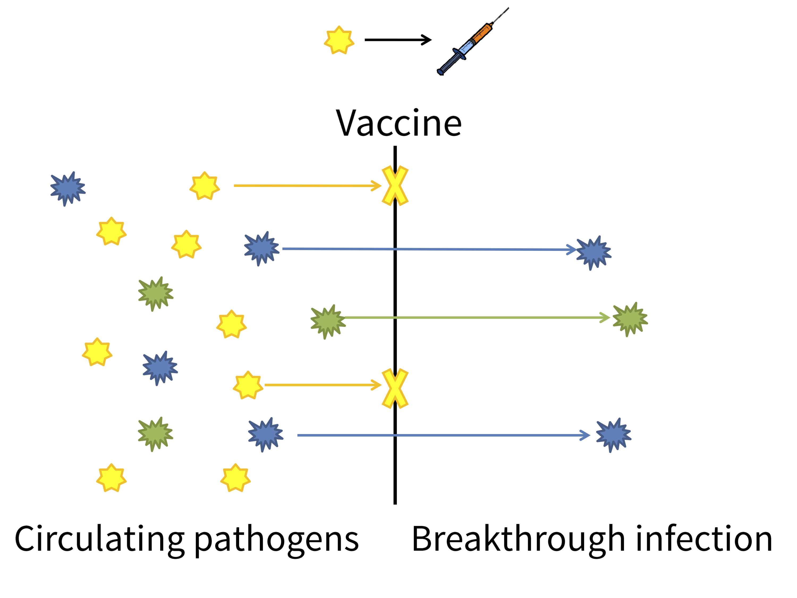
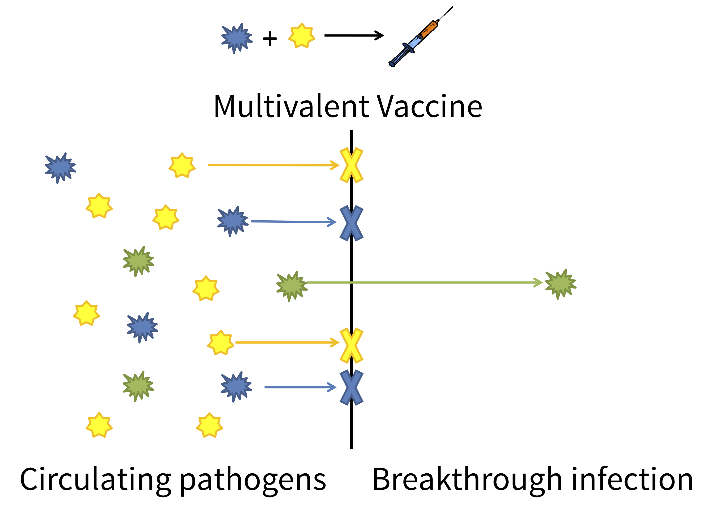
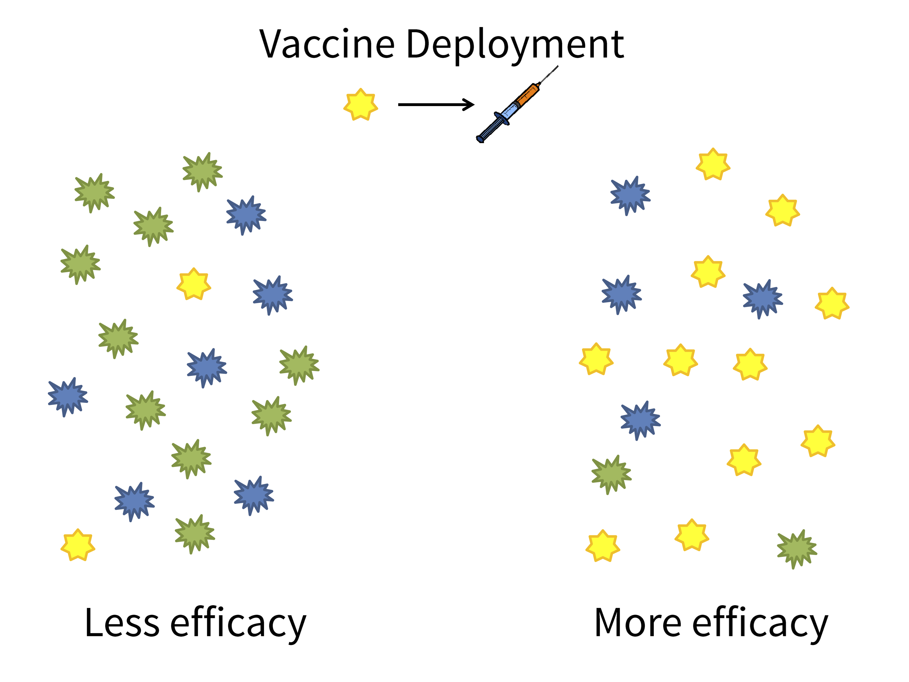
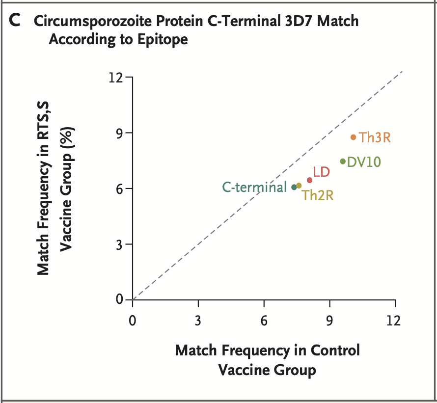
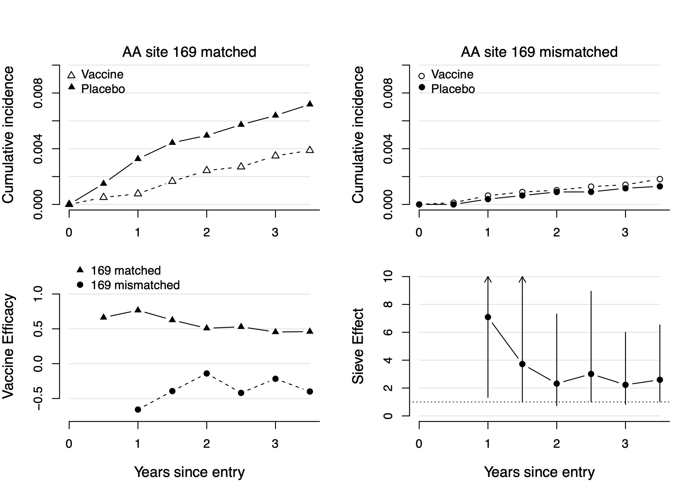

class: inverse, center, middle

.huge[Vaccine correlates]

```{r xaringan-themer, include=FALSE, warning=FALSE}
library(xaringanthemer)

extra_css <- list(
  ".inverse" = list(
    `background-image` = "url(img/virusbg.jpeg)",
    `background-size` = "cover"
    ),
  ".small" =  list(`font-size` = "80%"),
  ".tiny" =  list(`font-size` = "70%"),
  ".large" =  list(`font-size` = "150%"),
  ".huge" =  list(`font-size` = "300%"),
  "ul li" = list(`margin-bottom` = "10px"),
  ".gray" = list(color = "#C0C0C0"),
  ".red" = list(color = "#FF0000"),
  ".blue1" = list(color = "#3AABBE"),
  ".blue2" = list(color = "#2A6D90"),
  ".blue3" = list(color = "#446874"),
  ".purple" = list(color = "#624474"),
  ".mutedred" = list(color = "#745344"),
  "a" = list(color = "#3AABBE"),
  "a:hover" = list("text-decoration" = "underline")
)

style_mono_accent(
  base_color = "#446874",
  header_font_google = google_font("DM Sans"),
  text_font_google   = google_font("DM Sans", "400", "400i"),
  code_font_google   = google_font("Courier Prime"),
  extra_css = extra_css
)
```

<style type="text/css">
.remark-slide-content {
    font-size: 22px
}
</style>

---

## Correlates of risk/protection

Two, interrelated goals of correlates analysis are to 

* identify/validate possible __surrogate endpoints__;
* understand __protective mechanisms__ of vaccines. 

If an __immune correlate__ is established to __reliably predict vaccine efficacy__, then subsequent efficacy trials may use the CoP as the __primary endpoint__. 

__Accelerates approval__ of

* existing vaccines in __different populations__ (e.g., children);
* __new vaccines__ in the same class.

---

## Correlates of risk/protection

.large[__Two levels of correlates analysis__\*:]

__Correlates of risk:__

* Correlation of immune response in vaccine recipients with outcome
* Risk prediction
* Evaluates associative parameters

__Correlates of protection__

* Evaluate immune response's ability to predict vaccine efficacy
* Evaluates causal parameters

<br> <br> <br> 

.small[\* [Plotkin and Gilbert (2012)](https://doi.org/10.1093/cid/cis238), [Qin et al (2007)](https://doi.org/10.1086/522428)]

---

## Correlates of risk

```{r, cor1, echo = FALSE, out.height = "250px", fig.align = "center"}

```

* (Stratified) __Cox model__ in vaccinated participants
* Adjusted hazard ratios per 10-fold difference in marker

---

## Correlates of risk

```{r, cor2, echo = FALSE, out.height = "400px", fig.align = "center"}

```

* Population-level __cumulative incidence__ as a function of immune marker.

---

## Correlates of risk

.pull-left[

```{r, cor3, echo = FALSE, out.height = "250px", fig.align = "center"}

```

* Nonparametric __threshold finding__ approach.

]

.pull-right[

```{r, cor4, echo = FALSE, out.height = "250px"}
knitr::include_graphics("img/cor2.png")
```

* __Machine learning prediction__ using different sets of immune responses.\*

]

<br> <br>
.small[\* [Neidich et al (2019)](https://doi.org/10.1172/JCI126391)]

---

## Correlates of protection

__Effect modifiers of VE__

* How/does VE vary across subgroups defined by immune response?
* E.g., [Juraska et al (2020)](https://doi.org/10.1093/biostatistics/kxy074)


__Mediators of VE__

* What percentage of VE is attributable to immune response?
* [Cowling et al (2019)](https://doi.org/10.1093/cid/ciy759)
* [Benkeser et al (2021+)](https://arxiv.org/abs/2103.02643)

__Stochastic interventional VE__

* How/would shifting the immune response distribution impact VE?
* [Hejazi et al (2020)](https://doi.org/10.1111/biom.13375)

---

## Measuring correlates

Running assays on >30k samples is .red[expensive] and __statistically unnecessary__.

Instead we use a __case-cohort design__ ([Prentice, 1986](https://www.jstor.org/stable/2336266?seq=1)) to __measure immune responses__ in 
* a stratified random subcohort (\~1600 individuals)
* all SARS-CoV-2 endpoints

```{r, casecohortplot, echo = FALSE, out.height = "250px", fig.align = "center"}

```

---

## Statistical challenges

__Estimation in two-phase designs__

* Individuals who contract COVID may __differ from other participants__.
* Two-phase design .red[over-samples] these individuals.
* Augmented/inverse weighting approaches to __account for differences__.

__Low case numbers due to highly effective vaccines__

* Power for CoP analysis driven by __vaccine breakthroughs__.
* CoR $>$ 25 breakthroughs; CoP $>$ 50 breakthroughs.

__Remote computing__

* Moderna's data-sharing agreement with USG gives exclusive control to Moderna until the summer.
* Our correlates code must be run on their machines.

---

## Transparency and reproducibility

__CoVPN statisticians are committed to open science.__

* An in-progress, version-controlled SAP is [available](https://figshare.com/articles/online_resource/CoVPN_COVID-19_Vaccine_Efficacy_Trial_Immune_Correlates_SAP/13198595) for review.
* An [open-source GitHub repository](https://github.com/CoVPN/correlates_reporting) is being developed to implement methods involved in the SAP. 
  - Tools: R Markdown, `Make`, `renv`, `bookdown`, Travis CI, AWS

All primary analyses are undergoing double coding and code verification.

* Proof-of-concept for validation of ML in regulatory context.

<br>

Moderna correlates analysis will occur .red[early April] 😱.

---

class: inverse, center, middle

.huge[Sieve analysis]

---

## Sieve Analysis

```{r, sieve1, echo = FALSE, out.height = "500px", fig.align = "center"}

```

---

## Sieve Analysis

```{r, sieve2, echo = FALSE, out.height = "500px", fig.align = "center"}

```

---

## Sieve Analysis

```{r, sieve3, echo = FALSE, out.height = "500px", fig.align = "center"}

```
---

## HIV vaccines -- RV144 trial

The __ALVAC/AIDSVAX vaccine__ was evaluated in a Phase III efficacy trial. 

* Antigen consists of three HIV-1 envelope protein sequences.
* Efficacy evaluated in 16,395 HIV negative participants in Thailand. 

```{r,rv144, echo = FALSE, fig.align = "center", out.height = "300px" }
knitr::include_graphics("img/rv144Figure.png")
```

---

## Quantifying sieve effects

Data used for __vaccine sieve analysis__: 

* Random vaccine ( $V=1$ ) or control ( $V=0$ ) assignment.
* Infection/disease status ( $Y=1$ or $Y=0$ ) by end of followup. 
* Genotype of infecting pathogen classified into strains of interest, e.g., matched to vaccine ( $J=1$ ) or mismatched to vaccine ( $J=2$ ).

What summary of these data quantifies whether and __how vaccine efficacy differs__ based on the __genotype__ of the pathogen?

---

## Quantifying sieve effects

```{r, sieve2123, echo = FALSE, out.height = "500px", fig.align = "center"}

```

---

## Quantifying sieve effects

__Idea:__ Proportion of vaccine-matched endpoints in vaccine vs. control: $$
P(J = 1 \ | \ V = 1, Y = 1) \ \text{vs.} \ P(J = 1 \ | \ V = 0, Y = 1)  \ . 
$$

If a __sieve effect__ is present, these proportions should be .red[different].

```{r, sieve12421345, echo = FALSE, out.height = "350px", fig.align = "center"}

```

---

## Quantifying sieve effects

.red[Problem:] Only looking at the __population with the endpoint__! 

Population with endpoint likely differs population enrolled in trial! 

* No __causal interpretation__ of this quantity.

How can we __quantify sieve effects__ with respect to the __causal effect__ of the vaccine? 

---

## Quantifying sieve effects

Idea: __VE__ compares proportion with __any endpoint__ in __vaccine vs. control__. $$
P(Y = 1 \ | \ V = 1) \ \mbox{vs.} \ P(Y = 1 \ | \ V = 0) \ .
$$

What about studying __strain-specific efficacy__, defined as a comparison of the proportion of __strain-specific endpoints__ in __vaccine vs. control__. $$
P(Y = 1, J = j \ | \ V = 1) \ \mbox{vs.} \ P(Y = 1, J = j \ | \ V = 0) \ \ \mbox{for $j=1,2$.}
$$

Under assumptions, this is the __average causal effect__ of the vaccine on the incidence of __strain-specific endpoints__.

---

## Quantifying sieve effects

Typically we express $j$-specific __vaccine efficacy__ as $$
VE_j = 1 - \frac{P(Y = 1, J = j \ | \ V = 1)}{P(Y = 1, J = j \ | \ V = 0)}
$$
and we test the sieve null hypothesis $$
H_0: VE_1 = VE_2 \ . 
$$

Is the multiplicative effect of the vaccine the same against $J=1$ endpoints as it is against $J=2$ endpoints?

---

## Estimating sieve effects

We have developed methods that __estimate and test sieve effects__ using flexible regression techniques. 

* control for informative censoring
* control for informative vaccine uptake
* nice efficiency properties

[Benkeser et al (2018)](https://www.tandfonline.com/doi/abs/10.1080/01621459.2018.1529594), [Benkeser et al (2017)](https://onlinelibrary.wiley.com/doi/10.1002/sim.7337), [Benkeser et al (2020)](http://journal-sfds.fr/article/view/786)

---

## Sieve results

The RV144 vaccine exhibited __sieve effects at amino acid position 169__ of the V2 loop of the HIV Envelope protein 


```{r, sieve1243, echo = FALSE, out.height = "400px", fig.align = "center"}

```

---

## Sieve analysis for COVID 

Great interest in __sieve analysis__ for SARS-CoV2 .red[variants of concern].

* We are planning a sieve analysis of __Moderna's Phase 3__ trial.
* Other companies may come around as well...
* Competing interests? Maybe not this time.

---

## Current work

User-friendly approach to assessing __effect modification of sieve effects__. 

* E.g., is the strength of the sieve effect modified by age?
* Joint with __Guandong (Elliot) Yang and Laura Balzer (UMass)__.

Accounting for __missing genotypes__ in sieve analysis.

* Only \~50% of Moderna cases have genetic sequences.
* Appropriately accounting for missing data.
* Joint work with __Ziyue (Jeremy) Wu (Emory)__.

---

## Amazing statisticians

.pull-left[.tiny[
__Leadership__
* Dean Follmann (NIAID)
* Yonghong Gao (BARDA)
* Peter Gilbert (FHCRC, UW)

__NIAID__
* Martha Nason
* Mike Fay
* Pretty much all of NIAID Biostatistics

__CoVPN__
* Alex Luedtke (UW)
* Marco Carone (UW)
* Iván Díaz (Weill-Cornell)
* Nima Hejazi (Berkeley)
* many others!

]]

.pull-right[.tiny[
__Fred Hutch__
* Holly Janes
* Youyi Fong
* Yunda Huang
* Michal Juraska
* Ying Huang
* Ollivier Hyrien
* many others!

__OWS Company statisticians__
* Too many to name!
]
]
